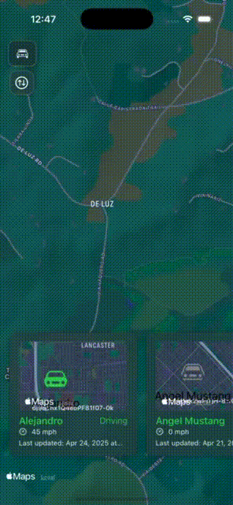
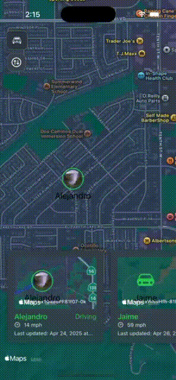
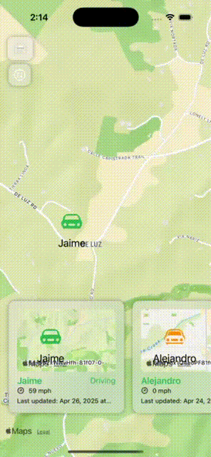

# MapPulse — Submission
---

## 📖 Overview
MapPulse is an iOS SwiftUI application which fetches live GPS device data from the OneStepGPS API, persists user preferences locally, and presents everything in both a map view and an animated device carousel. Along the way, it adds polished UI touches with glass-morphic search, smooth animations, clustering, and user-uploaded icons while keeping the core requirements front and center.

---

## ✅ Requirements & Implementation

| Requirement                                                                                       | How MapPulse Delivers                                                                                                                  |
|---------------------------------------------------------------------------------------------------|----------------------------------------------------------------------------------------------------------------------------------------|
| **API Integration**<br>Fetch `latest_point=true` feed                                              | • `APIClient` & `DevicePollingService` call OneStepGPS endpoint with polling, decode JSON into `Device` models.                 |
| **Map View with Real-Time Updates**<br>Markers, clustering, custom icons, status color cues        | • `ClusteredMapView` wraps `MKMapView` in SwiftUI<br>• Custom `DeviceAnnotationView` tints by status, shows user icon or Car by default  |
| **Device List View of Devices**<br>Name, position, active state/drive status                              | • `DeviceListView` A card that shows each device’s name with coloring indicating device status, last update, speed, drive status; search bar filters by name (debounced). <br>• Also featuring an intuitive mini-map for each device to gain overview of device in that region.               |
| **Device Detail View**<br>Coordinates, altitude, heading, battery, duration, distance                     | • Tappable carousel cards expand (`matchedGeometryEffect`) to reveal full `DeviceDetailView` with everything from raw GPS data        |
| **User-Editable Preferences**<br>Sort order, hide/unhide, user-uploaded icons                      | • Sort menu (none/altitude/speed/drive status)<br>• Context menu on each card (long press) to hide/unhide<br>|
| **Local Storage of Preferences**                                                                  | • `@AppStorage` for sort order & show-hidden toggle<br>• `HiddenDeviceService` saves hidden IDs in `UserDefaults`<br>• `UserIconManager` saves and retrieves user uploaded images on devices with `FileManager` & `UserDefaults`                    |


---

## ✨ What’s Extra

- **Glass-Morphic App Design theme**  
  - A custom Search Bar that expands/collapses with a spring animation—great visual polish.
  - Glass icons for user preferences.
  
- **Smooth Matched-Geometry Animations**  
  Cards morph seamlessly between carousel and detail layouts foer intuitive UX.

- **Debounced Search**  
  Reduces unnecessary filtering and scroll jitter by waiting 300 ms after typing stops.

- **Clustered MapKit Integration**  
  Automatically groups nearby markers and zooms/pans to selected devices with minimal boilerplate.

- **Modular and Code Readable-Friendly Architecture**  
  Protocol-driven networking (`APIClientType`/`NetworkTransport`) using Router pattern with Model View ViewModel (MVVM) and decoupled services (`HiddenDeviceService`, `UserIconManager`).

---

## 🏗️ Tech Stack & Patterns

- **Language & UI**: Swift 6 • SwiftUI (iOS 18+)
- **Concurrency**: Combine for reactive programming • `async`/`await` • `Task` polling loop  
- **Network Layer**:  
  - **Strategy**: `NetworkTransport` protocol → `URLSessionTransport`  
  - **Factory**: `APIRequest` builds `URLRequest` from `OneStepGPSEndpoint`  
  - **Decoder**: Custom ISO8601 + fractional-seconds as fallback format
- **Persistence**: `UserDefaults` (`AppStorage` + manual keys) + local file storage `FileManager` for icons  
- **Patterns**: MVVM • Dependency Injection (DI) • Coordinator (MapKit) • Strategy (sorting/filtering pipeline)

---

## Usage

- For search bar please tap the icon to search and tap it again on car icon to dismiss it.

## 🎥 App Preview (full working of app found as App_Demo.mp4 under AppGIFs directory)



---

## 🚀 Getting Started

**Clone the repo**  
   ```bash
   git clone https://github.com/your-username/MapPulse.git
   ```
